# Procesverslag

**Auteur:** Rose Mulazada

**De opdrachten:** [opdracht 1](opdracht1/index.html) en [opdracht 2](opdracht2/index.html)

**note voor opdracht 2: wanneer je 'i been drinkin' van 'future' toevoegt aan de playlist en het nummer dan afspeelt, krijg je de ingekorte versie terug - dit was om zeker te zijn dat alle nummers wel spelen. dan hoef je niet drie minuten te wachten op een nummer om te checken of het nummer erna zal afspelen of niet.
**note voor opdracht 2: 'i been drinkin' en 'say it' hebben een 'preview' versie - het is een prototype dus vandaar zijn niet alle nummers aan de linkerkant ingekort. 

## Bronnenlijst

1. https://stackoverflow.com/questions/22534084/can-i-create-border-bottom-without-diagonal-corner
2. https://stackoverflow.com/questions/6881045/css-animations-on-span
3. https://www.w3schools.com/jsref/jsref_localecompare.asp
4. http://sortablejs.github.io/Sortable/
5. https://font.gooova.com/fonts/14294/circular-std-font-family.html
6. Niet gebruikt maar wel als reference: https://listjs.com/
7. https://developer.mozilla.org/en-US/docs/Web/API/Node/nodeName
8. https://www.freecodecamp.org/news/how-to-sort-alphabetically-in-javascript/
9. https://developer.mozilla.org/en-US/docs/Web/JavaScript/Reference/Global_Objects/Array/sort

## Opdracht 1 plan

  
uitwerken na schetsen idee (voor week 2)

### Je storyboard:

  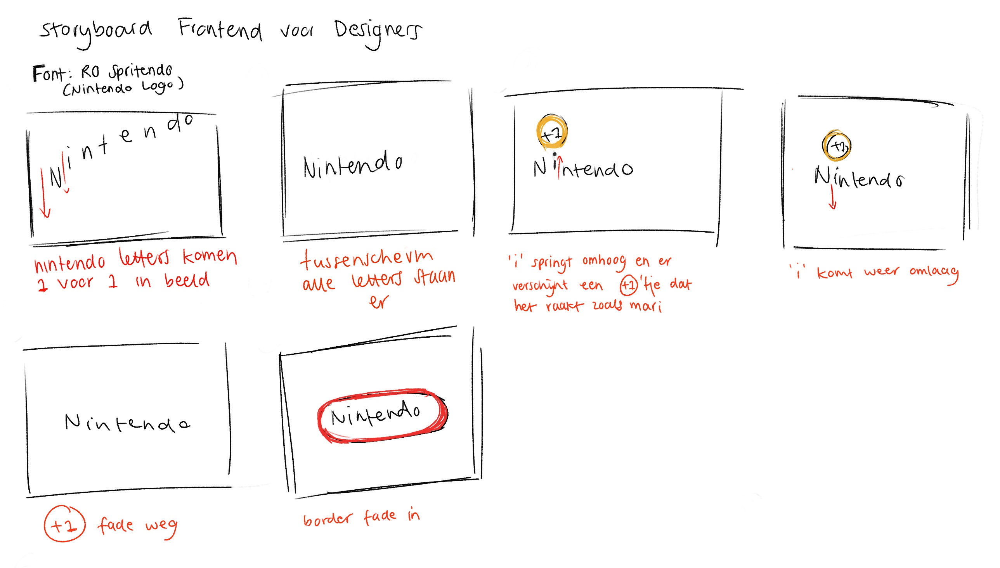

### Je ambitie:

Aan deze technieken/punten wil ik werken:

- Timen van de letters die 1 voor 1 omlaag vallen
- Het toevoegen van een bouncy feel/effect wanneer het 'i'tje omhoog springt tegen de '+1'
- Misschien het toevoegen van geluid als dat onderdeel is van wat wij gaan behandelen?
- Fade in & out animaties

## Opdracht 1 reflectie

  
uitwerken bij afronden opdracht (voor week 4)

### Je uitkomst - karakteristiek screenshot(s):

  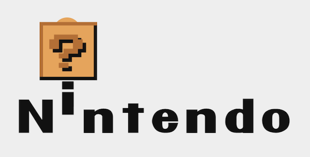

### Dit ging goed/Heb ik geleerd:

Korte omschrijving met plaatje(s)
Ik heb eigenlijk geen delays gebruikt en heb gewoon met z-index het blokje voor de coin gezet. Ik heb alles gepositioneerd met relative/absolute en elk element omhoog laten bewegen met verschillende snelheden zodat het lijkt alsof de letter 'i' het blokje raakt waardoor het muntje uit het blokje komt. Ik heb op alle spans display: inline-block gezet zodat ik de letters kon animeren en heb de ::after figuren op andere spans gezet dan de letter 'i' zodat de ::after niet meebewoog. Ook is het me gelukt om met opacity de border te laten animeren.
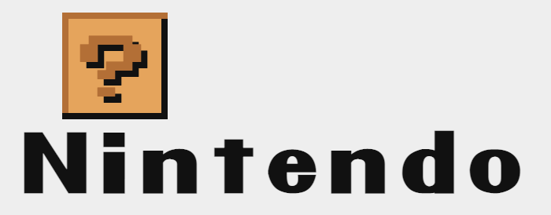

### Dit was lastig/Is niet gelukt:

Ik wil graag alle letters animeren zonder hierbij de ::after mee te nemen, ik kreeg gelijk het idee om een span aan te maken met een witte tekstkleur of iets in die richting zodat ik een ::after kan maken en die kan animeren i.p.v. een ::after voor een span maken met een letter uit het merk erin. Maar ik weet niet zeker of dit handig is of überhaupt mag. Ook wil ik leren hoe ik ervoor kan zorgen dat bijvoorbeeld de ::after nog langer op 100% blijft qua keyframes i.p.v. dat het gelijkt terugspringt naar de 0% positie.

  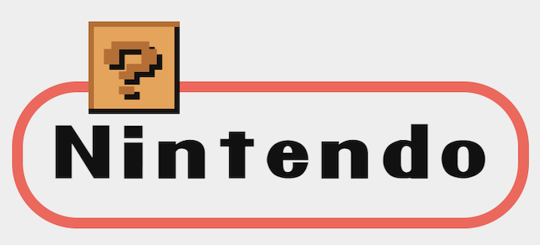

## Opdracht 2 plan

  
uitwerken na schetsen idee (voor week 5)

### Je ontwerp:

  

### Je ambitie:

Aan deze technieken/punten wil ik werken:

- Ik wil graag leren hoe ik zoveel mogelijk 1 functie kan schrijven die alles doet ipv verschillende die samen 1 doel berijken
- Ik wil graag kijken naar nieuwe technieken ipv wat ik al ken.

## Opdracht 2 test

  
uitwerken na testen (week 7)

Ik liep heel erg vast tijdens deze week, en heb later besloten om van case te veranderen. Om deze rede heb ik niet echt kunnen testen aangezien ik alleen CSS had en niks voor het belangrijkste deel waardoor het allemaal interactief moest worden, maar ik zal problemen opnoemen die ik heb ervaart bij mijn nieuwe case.
Neem minimaal 5 bevindingen op:

### Bevinding 1:

Nummers werden twee keer toegevoegd aan de playlist terwijl dat niet logisch is 

#### oplossing:

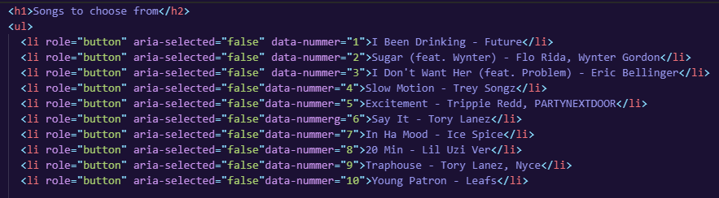
Ik heb data attributes toegevoegd waar ik later in een functie naar vraag. Er wordt hiermee in deze functie gekeken of het nummer al in de playlist staat en zo wel dan voegt hij het niet dubbel toe.

### Bevinding 2:

Ik kon mijn lists niet selecteren met alleen mijn toetsenbord. In plaats daarvan ging het elke individuele letter oplezen uit de zin. 

#### oplossing:
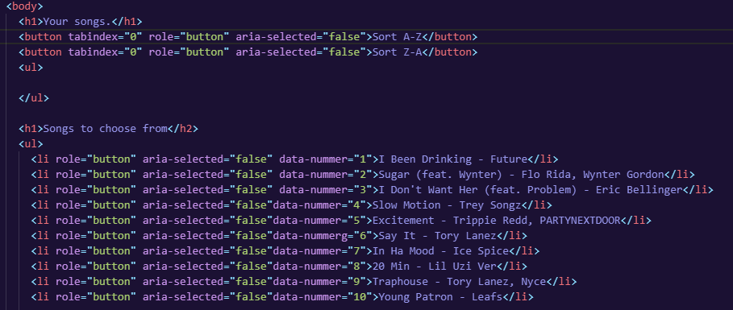
Ik heb de volgende attributes toegevoegd (tabindex, aria-selected, role) zodat de screenreader herkent dat erop gefocused kan worden.

### Bevinding 3:
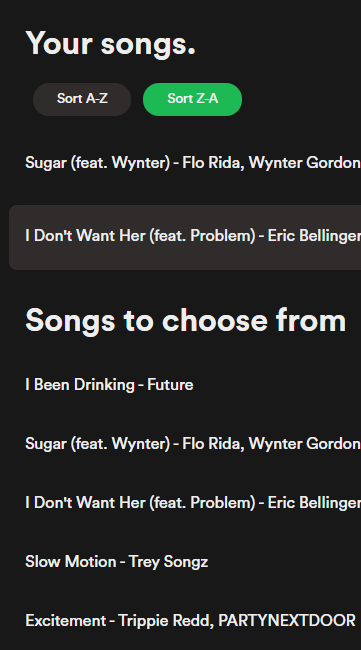
Als je op mobile maar 1 nummer hebt toegevoegd wordt de list automatisch gefocused waardoor je niet op remove kunt klikken. De button gaat offscreen.
Dit probleem heb ik nogsteeds.

### Bevinding 4:
Als ik op een button klik om te sorteren en vervolgens op de volgende knop klik krijgen beide knoppen dezelfde stijl.

#### oplossing:
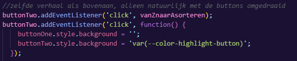
Ik heb deze code toegevoegd aan beide buttons om de stijl toe te voegen aan de geklikte knop en te verwijderen van de andere. Dan krijgt de niet geselecteerde knop de default stijl terug.

### Bevinding 5:
Ik had behalve het sorteren met a-z en z-a niks anders om te ordenen.

#### oplossing:
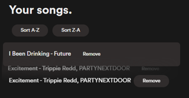
Ik heb de sortableJS library gekoppelt aan mijn code waardoor ik nu ook kan slepen.

## Opdracht 2 reflectie

  
uitwerken bij afronden opdracht (voor week 8)

### Je uitkomst - karakteristiek screenshot(s):

  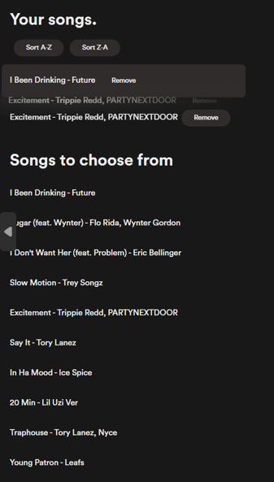

### Dit ging goed/Heb ik geleerd:

Korte omschrijving met plaatje(s)

  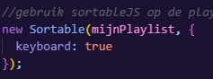
Hoe eenvoudig het eigenlijk is om libraries te gebruiken.. ik vond dit eerst best wel intimiderend maar toen ik echt ging opzoeken hoe ik dit kon doen was het geen probleem.

### Dit was lastig/Is niet gelukt:

Korte omschrijving met plaatje(s)

  
  Het is me nogsteeds niet gelukt om dit probleem op te lossen, ook niet met overflow en media queries. Dit is jammer want het maakt het moeilijker om op mobile nummers te verwijderen.

